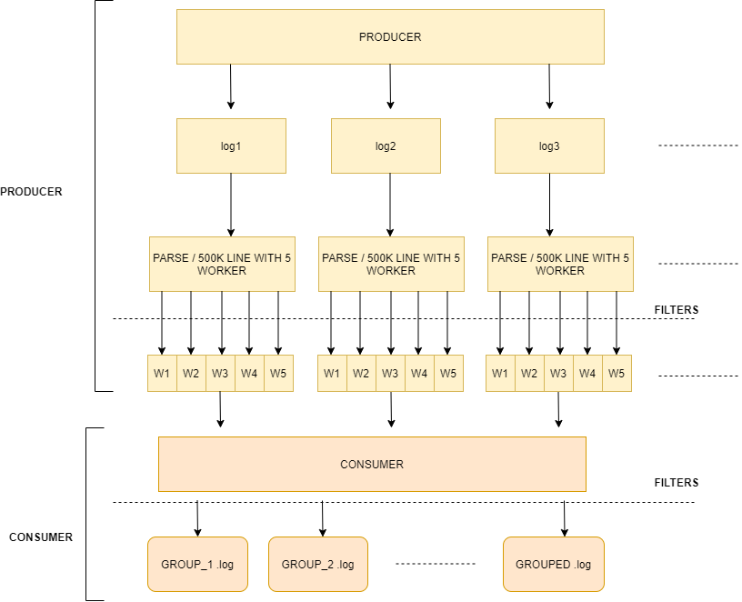

# Event management with goroutines and channels

This application simulates a producer-consumer interaction through goroutines and channels. In order to show the different ways of using the Goroutine concept; 
fan in / fan out and semaphore patterns have been used at different points of the flow.

## Run

`go run . -worker-number={number_of_worker}` starts the application with a number of worker which is passed in the parameter. If parameter is ignored, one worker will be run as default. 

## Test

`go test -bench . -worker-number={number_of_worker}` runs benchmark tests with a number of worker which is passed in the parameter. If parameter is ignored, one worker will be run as default.

## How it works:

There are two main actors in the application which are `Producer` and `Consumer`.

* Producer produces events and puts them to the channels by executing input files asynchronously via goroutines. After each log record is pulled out from a log file, 
  it is validated and then it is converted in to Json format. To distribute work load, fan out pattern is used at this point and multiple workers can be defined. 
  After each worker is executed successfully, result of workers are merged into another channel to be consumed by the consumer.
* Consumer retrieves and pulls events from the channel until it sends the close signal. Once a record is retrieved; first it is unmarshalled into a struct and based on its groupId, it is separated in a map to be added to its own specific output file. Once all events are consumed, output files are created based on groupIds and all records are saved into them.

As shown on the above illustration, Producer is represented by multiple goroutines as per log file which will produce events and insert them into the channels via workers.
Consumer is represented by a single goroutine which retrieves events and consumes all of them until closeSignal.

## Notes
* Detailed information on sample goroutine implementations can be found [Go Concurrency Patterns](https://blog.golang.org/pipelines).
* If another big file is needed to see how the code behaves under pressure, the below script can be used;
``for i in `seq 1 500000`; do echo "$i|log3|appsetup|tom|$((RANDOM))|$(( RANDOM % (10 - 7)+1))|1587583122"; done > /data/input/{file_name}.log``
The script creates a log file with 500K log records with random groupIds from 1 to 3.

## Memory profile

`go run . -mem-profile` will create a CPU profile file which can be similar with **mem-{id}.trace** 
Once the trace file is created, then it can be analyzed with `go tool trace mem-{id}.trace` This command will open a browser and show every detail of memory.

## CPU profile

`go run . -cpu-profile` will create a memory profile file which can be similar with **cpu-{id}.pprof**
Once the trace file is created, then it can be analyzed with `go tool trace mem-{id}.trace` This command will open a browser and show every detail of cpu.
